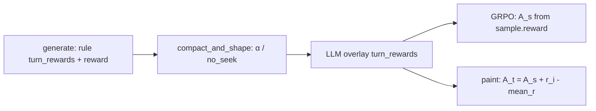

# 在线 LLM Turn Judge 方案

> 状态：设计文档（尚未合入训练代码）。  
> 离线打分/HTML 脚本：[`../llm_turn_credit_assign.py`](../llm_turn_credit_assign.py)。  
> 现有逐步优势：[`../offload_turn_advantage.py`](../offload_turn_advantage.py)。

## 1. 要解决什么问题

长轨迹 coding-agent RL 里，当前规则 `turn_rewards` 主要编码：

- 解没解开、cost、offload 格式/α、malformed 等

它**很难**回答：「哪几步真正推进了任务？哪次 offload 该不该？」

在线 LLM judge 做 **过程监督（process supervision）**：在一条轨迹内部给每一步分配信用，再通过已有 turn-painted GRPO 刷到 token。

## 2. 两层平均（不要混）

| 层级 | 比什么 | 信号 | 作用 |
|------|--------|------|------|
| **轨迹之间** | 同一 prompt 的 8 条 traj | outcome `sample.reward` → group 去均值 \(A_s\) | 谁整体更好 |
| **轨迹内部** | 同一 traj 的各 turn | LLM \(r_i\)，\(\bar r=\mathrm{mean}(r)\) | 哪一步更好/更差 |

训练优势（已有实现）：

\[
A_t = A_s + (r_i - \bar r)
\]

- \(A_s\)：**轨迹间** GRPO  
- \(r_i-\bar r\)：**轨迹内** 残差（LLM 负责）

在线 judge **默认不改** `sample.reward`（outcome 仍走规则 + help_seeking α shaping），只覆盖用于残差的 `turn_rewards`。

归一化默认 **`mean_to_outcome`**：缩放 LLM 分，使 \(\bar r \approx\) 该轨迹 outcome，残差尺度稳定、与 \(A_s\) 同量级。

## 3. 数据流



### 挂点（拟定）

挂在 `compact_and_shape_group_help_seeking_rewards` **之后**（sample-filter 末尾），而不是 `generate.py` 里提前 judge。

原因：filter 里的 `shape_group_help_seeking_rewards` 会改写 `turn_rewards` / `sample.reward`；若在 generate 先写 LLM 分，会被 α 逻辑盖掉。

顺序：

1. `generate`：规则 `compute_turn_rewards` → 写 `turn_rewards`、`sample.reward`，`attach_turn_advantage_metadata`
2. filter：`compact_filter` + `shape_group_help_seeking_rewards`（α / −no_seek）
3. **LLM overlay**：按 `session_id` 去重调 judge → 覆盖 `turn_rewards`，备份 `rule_turn_rewards`，重算 `turn_token_spans`
4. 训练：`_post_process_rewards` 对 outcome 做 group 去均值 → `compute_turn_advantages` 画 \(A_t\)

### 每次 judge 调几次

- **每个 `session_id` 一次**（不是每个 fan-out Sample 一次）
- 该 session 的所有 GRPO segment 写入**同一组** `turn_rewards`
- 各 segment 仍用自己的 `turn_token_spans` 画自己的 response 段

## 4. 覆盖范围与配置（拟定）

| Env | 默认 | 含义 |
|-----|------|------|
| `OFFLOAD_LLM_TURN_JUDGE` | `0` | `1` 开启在线 judge |
| `OFFLOAD_LLM_TURN_JUDGE_MIN_TURNS` | `8` | 少于此 turn 数 → skip，保留规则分 |
| `OFFLOAD_LLM_TURN_NORMALIZE` | `mean_to_outcome` | `raw` / `sum_to_outcome` / `mean_to_outcome` |
| `OFFLOAD_LLM_TURN_CONCURRENCY` | `4` | filter 内线程池并发 |
| `OFFLOAD_LLM_TURN_TIMEOUT` | `120` | 单轨迹 HTTP 超时（秒） |
| `DASHSCOPE_BASE_URL` | `http://208.64.254.189:8001/v1` | OpenAI-compatible endpoint |
| `DASHSCOPE_MODEL` | `deepseek-v4-flash-0731` | judge 模型 |
| `DASHSCOPE_API_KEY` | （已有） | Bearer |

- **Eval**：不开启  
- **失败/超时**：保留 shaping 后的规则 `turn_rewards`，训练不中断；metadata `llm_turn_judge=error`  
- **短轨迹**：`llm_turn_judge=skip`

### Metadata（拟定）

| 字段 | 含义 |
|------|------|
| `rule_turn_rewards` | overlay 前的规则分备份 |
| `turn_rewards` | 最终用于 paint 的分（LLM 或规则） |
| `llm_turn_judge` | `ok` / `skip` / `error` |
| `llm_turn_summary` | judge 一两句总评 |

## 5. Judge 输入/输出

**输入（压缩后）**：problem 摘要、`solved`、outcome reward、逐 turn 的 reasoning/content/tool_calls/observation/offload 标记（截断）。

**输出 JSON**：

```json
{
  "turns": [{"turn": 0, "score": 0.3, "reason": "..."}, "..."],
  "summary": "一两句总评"
}
```

评分原则（与离线脚本一致）：

- `score ∈ [-1, 1]`：推进为正，空转≈0，有害为负  
- 关注因果贡献，不是「忙不忙」  
- offload：该求助且后续推进 → 正；不必要求助 / 求助后无进展 → 低或负  
- 必须对每一 turn 打分

然后按 `OFFLOAD_LLM_TURN_NORMALIZE` 缩放到与 outcome 对齐。

---

## 6. 具体 Case

数据来源示意：run  
`agent_offload_pyrodash4b_phase2_sft00902_00_prob_5k_offload_insert_20260906_171737`  
rollout 0 · group 1 · instance **`task_001551_40ad9bb0`**（离线 LLM 已打过分；下列数字为方案说明用的示意演算）。

设该 group 的 outcome 去均值后：

| traj | solved | outcome \(R\) | 示意 \(A_s\) | n_turns | 是否 judge |
|------|--------|---------------|-------------|---------|------------|
| #0 | ✓ | 0.993 | +0.12 | 9 | 是（≥8） |
| #1 | ✗ | 0.050 | −0.82 | 8 | 是 |
| #2 | ✓ | 0.990 | +0.12 | 17 | 是 |
| #3 | ✓ | 0.993 | +0.12 | 9 | 是 |
| #4 | ✓ | 0.985 | +0.11 | 26 | 是 |
| #5–#7 | ✓ | ~0.99 | ~+0.12 | 12–13 | 是 |

公式统一用：

\[
A_t = A_s + (r_i - \bar r),\quad \bar r \approx R\ \text{（mean\_to\_outcome）}
\]

### Case 1：成功轨迹内「关键步 vs 摸鱼步」

**场景**：traj #0 解出，\(A_s=+0.12\)，\(\bar r\approx 0.993\)。

| turn 类型 | 示意 \(r_i\) | \(r_i-\bar r\) | \(A_t\) | 训练效果 |
|-----------|--------------|----------------|--------|----------|
| 写对 pipeline / 修编译 / 验证通过 | 1.20 | +0.207 | **+0.327** | 加强 |
| 重复 ls / 无信息空转 | 0.50 | −0.493 | **−0.373** | 削弱 |

对比：若不用 LLM、整段只 broadcast \(A_s=+0.12\)，好坏步优势相同。  
LLM 残差让**同一条成功轨迹内部**出现正负分化。

### Case 2：失败轨迹内「有效探索 vs 致命失误」

**场景**：traj #1 未解出，\(A_s=-0.82\)，\(\bar r\approx 0.05\)。

| turn 类型 | 示意 \(r_i\) | \(r_i-\bar r\) | \(A_t\) | 训练效果 |
|-----------|--------------|----------------|--------|----------|
| 读数据/摸清目录（有信息增益） | 0.30 | +0.25 | **−0.57** | 仍负（整条失败），但轻于坏步 |
| 编译已挂仍空操作 / 放弃修复 | −0.30 | −0.35 | **−1.17** | 更狠压制 |

要点：失败轨迹的 \(A_s\) 已经很负；LLM 不负责「救活整条」，只负责**失败路径上谁更该背锅**。

### Case 3：Offload 该不该求助（轨迹内，不是轨迹间）

**场景**：同一成功 traj，两处 offload。

| turn | 行为 | LLM 倾向 | \(r_i\) vs \(\bar r\) | 残差 |
|------|------|----------|----------------------|------|
| T3 | 简单 `cat` 也能做完，却 offload | 不必要求助 | \(r_i < \bar r\) | **负** → 抑制乱求助 |
| T10 | 编译错误绕不出，offload 后按建议修好 | 合理求助 | \(r_i > \bar r\) | **正** → 鼓励关键求助 |

**不会**用「这条比那条 offload 次数多」做轨迹间比较；次数差异若影响 outcome，已由 \(A_s\) 体现。

### Case 4：Fan-out 多段 Sample（去重）

**场景**：一条 session 因 offload/分支拆成 \(K=12\) 个 GRPO segment，共享同一 `session_id`、同一份完整 `turn_costs`（例如 26 turns）。

| 错误做法 | 正确做法 |
|----------|----------|
| 对 12 个 segment 各调 1 次 LLM | **只调 1 次**，结果写回 12 段 |
| 各段 `turn_rewards` 不一致 | 全员相同 `turn_rewards` |
| 共用一份 span | 各段用**自己的** `turn_token_spans` 画自己的 response |

代价：HTTP 次数 ≈ `#sessions`（≈ group 内 traj 数），不是 `#segments`。

### Case 5：短轨迹跳过

**场景**：某 traj `n_turns=5 < MIN_TURNS=8`。

- 不调 LLM  
- `turn_rewards` = 规则分（efficiency / α / malformed 等）  
- `llm_turn_judge=skip`  
- \(A_t\) 仍按规则 \(r_i\) 计算  

对准「长轨迹才需要过程监督」；短轨迹规则分通常够用。

### Case 6：Judge 超时 / JSON 解析失败

**场景**：endpoint 卡住或返回非 JSON。

- 保留 filter shaping 后的规则 `turn_rewards`  
- **`sample.reward` 不变** → \(A_s\) 不受影响  
- `llm_turn_judge=error`，打 warning  
- 该 traj 退化为「纯 outcome + 规则逐步」，训练继续  

### Case 7：Group 里有人 solo 解出（与 α 共存）

**场景**：8 条里 1 条 `offload_count=0` 且 solved；其余有人失败后求助。

- help_seeking：`SEEK_ONLY_WHEN_ALL_WRONG` → **不给**瞎求助 α（现有逻辑）  
- outcome / \(A_s\)：solo 解出者更高  
- LLM overlay：仍可对长轨迹打逐步分，但只动残差  

→ 轨迹间「该不该靠 offload 混分」仍由规则 α 管；轨迹内「求助的那几步有没有用」由 LLM 管。

### Case 8：数值对照小结（Case 1 展开）

```
traj #0  solved=1  R=0.993  A_s=+0.12

mean_to_outcome 后:
  r = [..., 1.20, ..., 0.50, ...]   mean ≈ 0.993

关键 turn:  A_t = 0.12 + (1.20 - 0.993) = +0.327
摸鱼 turn:  A_t = 0.12 + (0.50 - 0.993) = -0.373

若关闭 LLM（broadcast）:
  所有 turn: A_t = +0.12
```

策略梯度：关键步 token 得到更强正优势，摸鱼步甚至为负——这才是「在线过程监督」相对 outcome-only 的增量。

---

## 7. 与离线 HTML 的关系

| | 离线 `llm_turn_credit_assign.py` | 在线 judge（本方案） |
|--|----------------------------------|----------------------|
| 时机 | dump 后人工分析 | rollout filter 内 |
| 输出 | `credit_assign.html` / json | `metadata.turn_rewards` |
| 进训练 | 否 | 是（经 advantage paint） |
| 语义 | 可相同 prompt / 相同归一化 | 应对齐，便于对照 |

验收时可对同一 dump：开 judge 跑一小步，再把 `turn_rewards` 与离线 HTML 分并排看。

## 8. 验收清单（实现时）

1. Mock LLM：同一 session 多 segment 的 `turn_rewards` 完全一致；`sample.reward` 不变  
2. Mock 失败：回退规则分，不抛崩 filter  
3. `n_turns < MIN`：`skip`，无 HTTP  
4. 小流量：dump 中出现 `llm_turn_judge=ok` 与 `rule_turn_rewards`  
5. 开关对照：outcome（`raw_reward`）分布接近；开 judge 后轨迹内 `turn_rewards` 方差上升  

## 9. 非目标（本方案明确不做）

- 不用 LLM 分数替换轨迹间 \(A_s\)（不做「8 条轨迹互相 LLM 排序」当 group reward）  
- 不在 eval 路径调用 judge  
- 不在本阶段蒸馏逐步 reward model（可后续用离线标注数据做）  

## 10. 相关代码锚点

- 规则逐步分：`offload.compute_turn_rewards`  
- Group α：`offload.shape_group_help_seeking_rewards` / `compact_and_shape_group_help_seeking_rewards`  
- 挂载 span：`offload.attach_turn_advantage_metadata`  
- 画优势：`offload_turn_advantage.compute_turn_advantages`  
- 离线 judge + HTML：`llm_turn_credit_assign.py`  
- Filter 调用：`slime/rollout/sglang_rollout.py`（`rollout_sample_filter_path`）  
